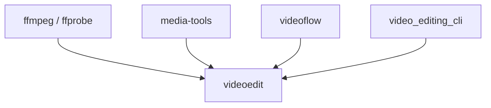

# Architecture

`videoedit` is designed as a reusable library with a CLI on top, aimed at fast-beating music video assembly workflows.

## Stack

1. FFmpeg and ffprobe do the actual media work.
2. `VideoEditingService` provides a stable Python API for applications.
3. CLI command modules translate terminal arguments into service calls.

## Dependency Graph

`videoedit` is now the canonical implementation layer. The legacy repos are compatibility wrappers that forward to it.

## Current Feature Ownership

Use `videoedit` as the primary library for:

- manifest-driven editing workflows
- `VideoEditingService`
- timeline planning and rendering
- playlist/concat rendering
- canvas rendering
- low-level media helpers migrated from `media-tools`
  probe, trim, concat, normalize, extract audio, thumbnails, conversion, and download helpers

Use `videoflow` only for the features that have not been fully absorbed into `videoedit` yet:

- beat analysis
  `videoflow.audio.analyze_beats`
- scene detection
  `videoflow.analysis.detect_scenes`
- funscript generation
  `videoflow.generate.generate_from_beats`

Compatibility layers:

- `media-tools` re-exports low-level helpers from `videoedit`
- `video_editing_cli` re-exports the old service and CLI surface from `videoedit`
- `videoflow` re-exports reel/canvas/audio-mix classes from `videoedit`, while still owning analysis/generation modules

## Why this adds value

The value of this project should come from the layer above FFmpeg:

- friendlier interfaces for Python applications
- reusable workflows and conventions
- validation and safer defaults
- documentation, examples, and tests that make integration easier
- human-readable JSON manifests for cut lists and timeline assembly
- tooling that makes rapid music-video iteration easier than working with raw FFmpeg commands alone
- named visual look presets that help fast-cut edits feel more color-consistent
- global audio mix presets with section-level exceptions for fast-cut assembly workflows
- playlist-style concat workflows with optional markers and spacers for multi-video outputs
- restrained text titles, embedded title styles, and simple branding overlays for polished outputs
- simple credits pages and a final copyright frame for complete presentation workflows

## Design rule

Prefer putting reusable behavior in the service layer first. The CLI should stay thin and call into library code rather than owning the real logic.

## Color direction

For assembled outputs, the library should support named look presets that apply a global visual style and also reduce distracting color jumps between adjacent clips.

In v1, this should be preset-driven and automatic by default:

- choosing a look preset should also enable clip-to-clip color harmonization
- users may explicitly disable harmonization, but the default path should favor fast, visually cohesive edits
- the goal is continuity across rapid scene changes, not full bad-lighting repair

## Audio direction

For assembled outputs, the library should support a global audio mix preset that defines how soundtrack audio and source audio are combined across the whole video.

In v1, this should be workflow-driven and simple by default:

- users choose one overall mix preset for the edit
- the library normalizes and blends music and source audio automatically
- individual clips or sections may override the default for moments like ambient-only or music-only scenes
- v1 overrides stay simple, with section-level behavior and optional fade-in/fade-out timing
- music input should be supported from the manifest and overridable from the CLI for quick iteration

## Concat direction

`concat` should remain one command, but support two modes:

- quick file-list mode for combining videos with minimal setup
- playlist JSON mode for per-item timing, markers, and transition control

In v1, concat should focus on playlist-style outputs:

- optional global black spacers between clips
- optional clip-start markers for navigation
- source-relative trim timing per clip in playlist mode
- simple global defaults in quick mode, with more refined per-item control in JSON

## Presentation direction

The library should support a small set of tasteful presentation features for labeling and branding rendered outputs.

In v1, this should include:

- text-first clip or section titles with transparent rendering over video
- reusable title styles embedded directly in the manifest
- anchor-based placement with offsets for easy iteration
- optional accent lines for restrained editorial styling
- a branding bug modeled as a transparent PNG with size, location, opacity, and timing
- an optional intro card with a black default background or a supplied branding video, plus simple program-title text
- optional paged credits on a color, image, or video background
- a separate copyright closing frame with small anchored text

